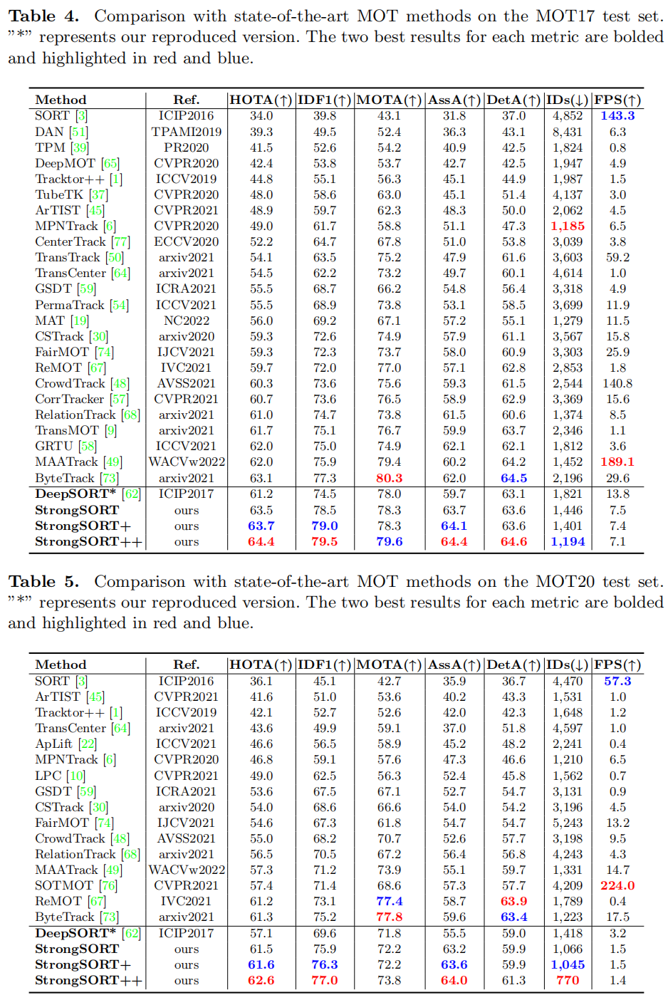

# StrongSORT
**StrongSORT: Make DeepSORT Great Again**

[](https://arxiv.org/abs/2202.13514) [](https://opensource.org/licenses/GPL-3.0) 

[](https://paperswithcode.com/sota/multi-object-tracking-on-mot17?p=strongsort-make-deepsort-great-again)

[](https://paperswithcode.com/sota/multi-object-tracking-on-mot20-1?p=strongsort-make-deepsort-great-again)


## News

- [2022.06.10] "YOLO+OSNet+StrongSORT" is supported in https://github.com/mikel-brostrom/Yolov5_StrongSORT_OSNet.

- [2022.08.19] StrongSORT has been supported in [mmtracking](https://github.com/open-mmlab/mmtracking). More details in [branch dev-1.x](https://github.com/open-mmlab/mmtracking/tree/dev-1.x/configs/mot/strongsort).

- [2022.11.30] The packaged version of StrongSORT is supported (https://pypi.org/project/strongsort/). More details in https://github.com/kadirnar/strongsort-pip.

- [2023.01.23] The paper "StrongSORT: Make DeepSORT Great Again" is accepted by [TMM (IEEE Transactions on Multimedia)](https://ieeexplore.ieee.org/document/10032656).

- [2023.06.23] StrongSORT available in [BoxMOT](https://pypi.org/project/boxmot) as a pluggable component for object detectors. More details [here](https://github.com/mikel-brostrom/yolo_tracking).

## Star History

[](https://star-history.com/#dyhBUPT/StrongSORT&Date)

## Abstract

Existing Multi-Object Tracking (MOT) methods can be roughly classified as tracking-by-detection and joint-detection-association paradigms. Although the latter has elicited more attention and demonstrates comparable performance relative to the former, we claim that the tracking-by-detection paradigm is still the optimal solution in terms of tracking accuracy. In this paper, we revisit the classic tracker DeepSORT and upgrade it from various aspects, i.e., detection, embedding and association. The resulting tracker, called StrongSORT, sets new HOTA and IDF1 records on MOT17 and MOT20. We also present two lightweight and plug-and-play algorithms to further refine the tracking results. Firstly, an appearance-free link model (AFLink) is proposed to associate short tracklets into complete trajectories. To the best of our knowledge, this is the first global link model without appearance information. Secondly, we propose Gaussian-smoothed interpolation (GSI) to compensate for missing detections. Instead of ignoring motion information like linear interpolation, GSI is based on the Gaussian process regression algorithm and can achieve more accurate localizations. Moreover, AFLink and GSI can be plugged into various trackers with a negligible extra computational cost (591.9 and 140.9 Hz, respectively, on MOT17). By integrating StrongSORT with the two algorithms, the final tracker StrongSORT++ ranks first on MOT17 and MOT20 in terms of HOTA and IDF1 metrics and surpasses the second-place one by 1.3 - 2.2. Code will be released soon.

## vs. SOTA



## Data&Model Preparation

1. Download MOT17 & MOT20 from the [official website](https://motchallenge.net/).

   ```
   path_to_dataset/MOTChallenge
   ├── MOT17
   	│   ├── test
   	│   └── train
   └── MOT20
       ├── test
       └── train
   ```

2. Download our prepared [data](https://drive.google.com/drive/folders/1Zk6TaSJPbpnqbz1w4kfhkKFCEzQbjfp_?usp=sharing) in Google disk (or [baidu disk](https://pan.baidu.com/s/1EtBbo-12xhjsqW5x-dYX8A?pwd=sort) with code "sort")

   ```
   path_to_dataspace
   ├── AFLink_epoch20.pth  # checkpoints for AFLink model
   ├── MOT17_ECC_test.json  # CMC model
   ├── MOT17_ECC_val.json  # CMC model
   ├── MOT17_test_YOLOX+BoT  # detections + features
   ├── MOT17_test_YOLOX+simpleCNN  # detections + features
   ├── MOT17_trainval_GT_for_AFLink  # GT to train and eval AFLink model
   ├── MOT17_val_GT_for_TrackEval  # GT to eval the tracking results.
   ├── MOT17_val_YOLOX+BoT  # detections + features
   ├── MOT17_val_YOLOX+simpleCNN  # detections + features
   ├── MOT20_ECC_test.json  # CMC model
   ├── MOT20_test_YOLOX+BoT  # detections + features
   ├── MOT20_test_YOLOX+simpleCNN  # detections + features
   ```

3. Set the paths of your dataset and other files in "opts.py", i.e., root_dataset, path_AFLink, dir_save, dir_dets, path_ECC. 

Note: If you want to generate ECC results, detections and features by yourself, please refer to the [Auxiliary tutorial](https://github.com/dyhBUPT/StrongSORT/blob/master/others/AuxiliaryTutorial.md).

## Requirements

- pytorch
- opencv
- scipy
- sklearn

For example, we have tested the following commands to create an environment for StrongSORT:

```shell
conda create -n strongsort python=3.8 -y
conda activate strongsort
pip3 install torch torchvision torchaudio
pip install opencv-python
pip install scipy
pip install scikit-learn==0.19.2
```

## Tracking

- **Run DeepSORT on MOT17-val**

  ```shell
  python strong_sort.py MOT17 val
  ```

- **Run StrongSORT on MOT17-val**

  ```shell
  python strong_sort.py MOT17 val --BoT --ECC --NSA --EMA --MC --woC
  ```

- **Run StrongSORT++ on MOT17-val**

  ```shell
  python strong_sort.py MOT17 val --BoT --ECC --NSA --EMA --MC --woC --AFLink --GSI
  ```

- **Run StrongSORT++ on MOT17-test**

  ```shell
  python strong_sort.py MOT17 test --BoT --ECC --NSA --EMA --MC --woC --AFLink --GSI
  ```

- **Run StrongSORT++ on MOT20-test**

  ```shell
  python strong_sort.py MOT20 test --BoT --ECC --NSA --EMA --MC --woC --AFLink --GSI
  ```

## Evaluation

We use the official code [TrackEval](https://github.com/JonathonLuiten/TrackEval) to evaluate the results on the MOT17-val set.
To make it easier for you to get started, we provide the MOT17-val annotations on [Google](https://drive.google.com/drive/folders/1Zk6TaSJPbpnqbz1w4kfhkKFCEzQbjfp_?usp=sharing) & [Baidu](https://pan.baidu.com/s/1EtBbo-12xhjsqW5x-dYX8A?pwd=sort) disk, in the folder "MOT17-train".

Please prepare the code and environment of TrackEval first and link the downloaded folder "MOT17-train" with folder "data/gt/mot_challenge" of TrackEval as:
```shell
ln -s xxx/MOT17-train xxx/TrackEval/data/gt/mot_challenge
```

We also provide some tracking results on the disk, in the folder "MOT17-val_results".
You can download them, cd to the TrackEval dir and try to evaluate the StrongSORT++ as:
```shell
python scripts/run_mot_challenge.py \
--BENCHMARK MOT17 \
--SPLIT_TO_EVAL train \
--TRACKERS_TO_EVAL xxx/MOT17-val_results/StrongSORT++ \
--TRACKER_SUB_FOLDER '' \
--METRICS HOTA CLEAR Identity VACE \
--USE_PARALLEL False \
--NUM_PARALLEL_CORES 1 \
--GT_LOC_FORMAT '{gt_folder}/{seq}/gt/gt_val_half_v2.txt' \
--OUTPUT_SUMMARY False \
--OUTPUT_EMPTY_CLASSES False \
--OUTPUT_DETAILED False \
--PLOT_CURVES False
```
Note: you may also need to prepare the `SEQMAPS` to specify the sequences to be evaluated.

## Note

- You can also try to apply AFLink and GSI to other trackers. We would be glad if you could tell us your new results.
- Tuning the hyperparameters carefully would bring better performance.

## Citation

```
@article{du2023strongsort,
  title={Strongsort: Make deepsort great again},
  author={Du, Yunhao and Zhao, Zhicheng and Song, Yang and Zhao, Yanyun and Su, Fei and Gong, Tao and Meng, Hongying},
  journal={IEEE Transactions on Multimedia},
  year={2023},
  publisher={IEEE}
}
```
You can also consider reading and citing our related work, [GIAOTracker](https://github.com/dyhBUPT/GIAOTracker), which won the 2nd place in the VisDrone2021 MOT Challenge of ICCV Workshop:
```
@InProceedings{Du_2021_ICCV,
    author    = {Du, Yunhao and Wan, Junfeng and Zhao, Yanyun and Zhang, Binyu and Tong, Zhihang and Dong, Junhao},
    title     = {GIAOTracker: A Comprehensive Framework for MCMOT With Global Information and Optimizing Strategies in VisDrone 2021},
    booktitle = {Proceedings of the IEEE/CVF International Conference on Computer Vision (ICCV) Workshops},
    month     = {October},
    year      = {2021},
    pages     = {2809-2819}
}
```

## Acknowledgement

A large part of the codes, ideas and results are borrowed from [DeepSORT](https://github.com/nwojke/deep_sort), [JDE](https://github.com/Zhongdao/Towards-Realtime-MOT), [YOLOX](https://github.com/Megvii-BaseDetection/YOLOX) and [ByteTrack](https://github.com/ifzhang/ByteTrack). Thanks for their excellent work!


### &#8627; Stargazers
[](https://github.com/dyhBUPT/StrongSORT/stargazers)

### &#8627; Forkers
[](https://github.com/dyhBUPT/StrongSORT/network/members)

